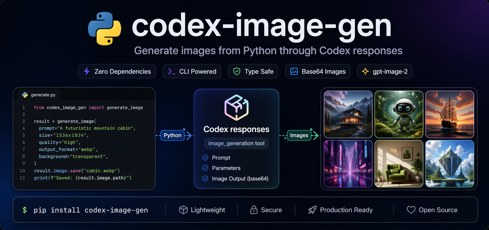
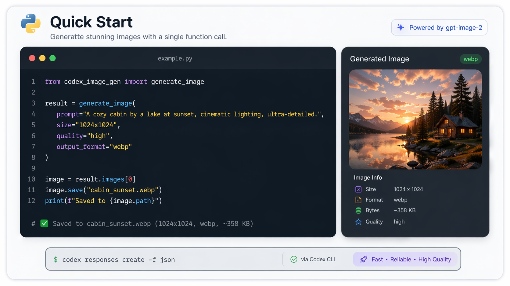
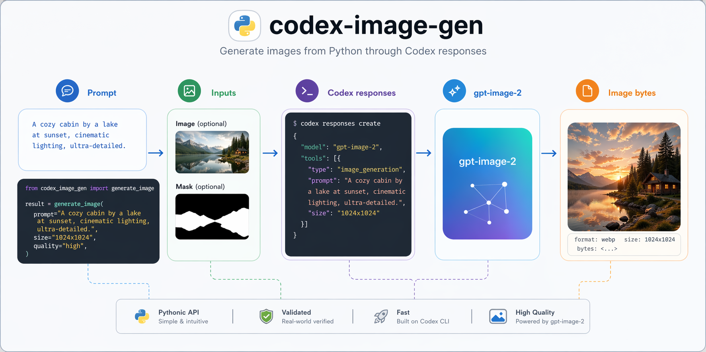
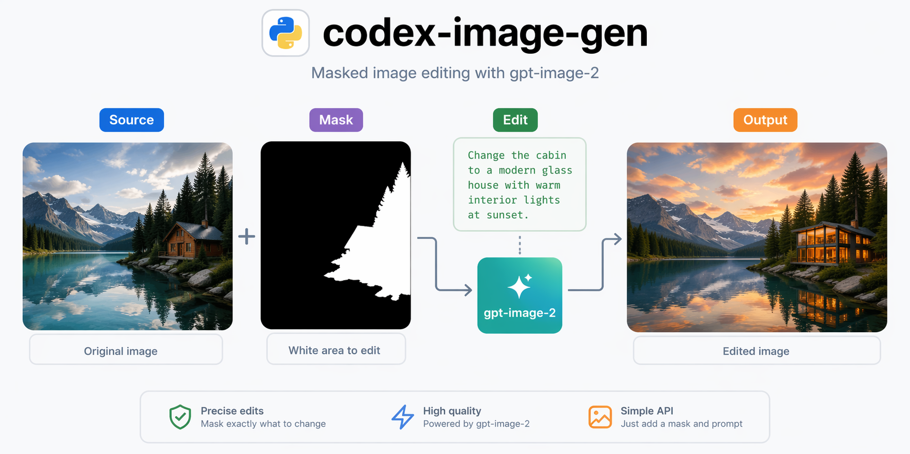

<div align="center">
  

  <h1>codex-image-gen</h1>
  <p><strong>Generate images from Python through Codex responses</strong></p>

  <p>
    <a href="./README.md">English</a> ·
    <a href="./README.ko.md">한국어</a>
  </p>

  <p>
    <a href="https://github.com/smturtle2/codex-image-gen/actions/workflows/workflow.yml"></a>
    <a href="https://github.com/smturtle2/codex-image-gen/releases/tag/v0.1.0"></a>
    <a href="./LICENSE"></a>
    
    
    
  </p>
</div>

---

`codex-image-gen` is a tiny, dependency-clean Python library for generating
high-quality images through the Codex CLI's `responses` command and the
Responses API `image_generation` tool.

It uses your existing Codex login, sends a raw Responses payload to
`codex responses`, and returns Python dataclasses with decoded image bytes and
metadata.

## Demo

<p align="center">
  
</p>

<p align="center">
  <em>Generated with <code>codex-image-gen</code> + <code>gpt-image-2</code>.</em>
</p>

## Quick Start

<p align="center">
  
</p>

```bash
uv add codex-image-gen
```

```python
from pathlib import Path

from codex_image_gen import generate_image

result = generate_image(
    "A serene mountain landscape with a lake and pine trees, sunset light",
    size="1024x1024",
    quality="low",
    output_format="png",
)

image = result.images[0]
Path("mountain.png").write_bytes(image.data)
print("saved:", image.mime_type, len(image.data), "bytes")
```

That's it. Your image is saved locally.

## Features

<p align="center">
  
</p>

| | |
| --- | --- |
| **High-quality images**<br>Powered by `gpt-image-2` through Codex responses. | **Multiple input types**<br>Use local paths, URLs, data URLs, file IDs, and detail mappings. |
| **Robust and reliable**<br>Clear exceptions for Codex failures, invalid JSON, missing image results, and bad base64. | **Live-tested parameter surface**<br>Forward the gpt-image-2 options that work through the current Codex bridge. |
| **Typed results**<br>Frozen dataclasses with image bytes, MIME type, response ID, call ID, revised prompt, and partial images. | **Zero heavy deps**<br>Runtime uses only the Python standard library and the Codex CLI. |

## API Highlights

```python
generate_image(
    prompt: str,
    *,
    images=None,
    model="gpt-5.4",
    size="auto",
    quality="auto",
    output_format="png",
    output_compression=None,
    background="auto",
    action="auto",
    input_image_mask=None,
    moderation=None,
    partial_images=None,
    instructions=None,
    timeout=300,
    codex_bin="codex",
)
```

- Simple, composable function API.
- Rich result objects with images, metadata, raw response data, and optional
  partial images.
- Reference images can be local files, remote URLs, `data:` URLs, or file IDs.
- Masked edits use `input_image_mask`; pass a mask as a local path, URL,
  `data:` URL, or file ID. The mask must match the edited image's dimensions
  and format, stay under 50 MB, and include an alpha channel.
- Timeouts, moderation, output format, compression, and custom instructions are
  first-class options.

## Examples

### Edit With References

```python
result = generate_image(
    "Edit the reference image into a watercolor postcard",
    images=[
        "reference.png",
        {"file_id": "file_123", "detail": "high"},
    ],
    action="edit",
    output_format="webp",
    output_compression=75,
)

Path("postcard.webp").write_bytes(result.images[0].data)
```

### Masked Edits

<p align="center">
  
</p>

The diagram is a workflow illustration. For an actual masked edit, use an
alpha-channel mask with the same dimensions and format as the image you edit.

```python
result = generate_image(
    "Replace only the masked logo area with a white star",
    images=["product.png"],
    input_image_mask="mask_alpha.png",
    action="edit",
    background="opaque",
)

Path("edited.png").write_bytes(result.images[0].data)
```

### Partial Images

```python
result = generate_image(
    "Create a polished app icon of a glass bottle",
    partial_images=2,
)

for partial in result.partial_images:
    Path(f"partial-{partial.index}.png").write_bytes(partial.data)
```

Partial images are collected after `codex responses` exits. This function does
not expose live streaming callbacks.

## Compatibility

This library intentionally exposes only the parameters that worked through the
current `codex responses` bridge in live tests.

- The image generation tool always sends `model="gpt-image-2"`.
- `input_image_mask` is exposed because it is documented for the Responses
  `image_generation` tool and was live-tested through the Codex bridge. The
  library forwards your mask; it does not synthesize the required alpha channel.
- `background="transparent"` is rejected before calling Codex.
- `input_fidelity` is not exposed because `gpt-image-2` rejects it.
- `previous_response_id` and previous `image_generation_call` item references
  are not exposed because Codex requires `store=false`; prior items are not
  persisted. Use image bytes, local files, URLs, or file IDs for follow-up edits.

## Development

```bash
git clone https://github.com/smturtle2/codex-image-gen.git
cd codex-image-gen
uv sync --dev
uv run ruff check .
uv run pytest
uv build
```

## Project Links

| Link | Description |
| --- | --- |
| [Documentation](./README.md) | Full docs and guide |
| [Examples](#examples) | Real-world usage snippets |
| [Contributing](#development) | Local development workflow |
| [Issues](https://github.com/smturtle2/codex-image-gen/issues) | Report bugs and request features |
| [Discussions](https://github.com/smturtle2/codex-image-gen/discussions) | Ask questions |
| [PyPI](https://pypi.org/project/codex-image-gen/) | Published Python package |
| [Release v0.1.0](https://github.com/smturtle2/codex-image-gen/releases/tag/v0.1.0) | Wheel and sdist artifacts |

## Release

`v0.1.0` is available on PyPI and as a GitHub Release with wheel and sdist
artifacts.

Install from PyPI:

```bash
uv add codex-image-gen
```

## License

MIT
